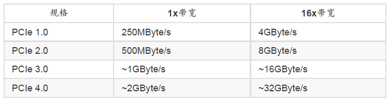

# 第零章 计算机概论

Created: Dec 15, 2020 11:11 AM
Tags: Dec 17, 2020 4:34 PM

## 0.1 电脑

### 0.1.1 计算机硬件的五大原件

- 输出单元
- 输出单元
- CPU的控制单元
- CPU的算数逻辑单元
- 内存

中央处理器

中央处理器 （Central Processing Unit, CPU），CPU 为一个具有特定功能的芯片， 里头含有微指令集
cpu分为两单元：算数逻辑单元和控制单元。

- 算数逻辑单元，负责程序运算和逻辑判断
- 控制单元，协调各周边元件与各单元间的工作

### 0.1.2 一切涉及的起点： CPU的架构

两种主要的CPU架构：

- 精简指令集（Reduced Instruction Set Computer, RISC）

    每个指令较为精简，执行时间短，完成动作单纯，执行性能较佳
    但针对复杂的事情，需要由多个指令来完成

    常见RISC
    - 甲骨文 （Oracle） 公司的 SPARC 系列
    - IBM 公司的 Power Architecture （包括 PowerPC） 系列
    - 安谋公司 （ARM Holdings） 的 ARM CPU 系列

- 复杂指令集（Complex Instruction Set Computer, CISC）

    每个指令可以执行一些较低阶的硬件操作，指令数目多而且复杂，每条指令的长度并不相同。指令执行较为复杂，每条执行花费时间较长

    常见CISC
    - AMD、Intel、VIA等的x86架构的CPU

    x86叫法来由：最早的那颗Intel发展出来的CPU代号称为8086，后来依此架构又开发出80286,80386...， 因此这种架构的CPU就被称为x86架构了。
    在2003年以前由Intel所开发的x86架构CPU由8位升级到16、32位，后来AMD依此架构修改新一代的CPU为64位， 为了区别两者的差异，因此64位的个人电脑CPU又被统称为x86_64

### 0.1.3 其它单元的设备

- 系统单元
- 存储单元
- 输入、输出单元

### 0.1.5 电脑按用途分类

- 超级计算机（Supercomputer）,运行速度最快
- 大型计算机（Mainframe Computer）
- 迷你电脑（Minicomputer）
- 工作站（Workstation）
- 微电脑（Microcomputer）

0.1.6 电脑常用计算单位（容量、速度等）

- 容量单位

    电脑对数据的判断主要依据有没有通电来记录信息，即0和1

    1 Byte = 8 bits

    

- 速度单位

    MHz GHz Hz

### 0.2.1 Intel芯片架构

两个桥接器来控制各元件的沟通

- 北桥：负责连接速度较快的CPU、内存和显卡接口等元件
目前主流架构中，大多将北桥内存控制器整合到CPU封装中
- 南桥：负责连接速度较慢的设备接口，包括硬盘、USB、网卡等等

单核心CPU：仅有一个运算单元。多核中潜入了两个以上

CPU频率：每秒可以工作的次数。3.6GHz，表示这颗CPU在一秒内可以进行3.6*10^9次工作（1GHZ=10^3MHZ=10^6KHZ= 10^9HZ）
外频和倍频：早期北桥存在时，北桥相连的设备工作频率要相等，但CPU运行速度要快，因此需要在CPU内部再进行加速。外频之CPU与外部元件进行数据传输的速度，倍频是CPU内部用来加速工作性能的一个倍数，两者相乘才是CPU的频率速度——内频 = 外频 *倍频

**CPU超频：**将CPU的倍频或者是外频通过主板的设置功能更改成较高频率的方式

内存频率：来自CPU内的内存控制器所决定

内存每次频率能够传输的数据量，大多为64位。如 1600MHz 64bit = 1600MHz 8Bytes = 12.8GByte/s

CPU每次能够处理的数据量称为字组大小（word size）， 字组大小依据
CPU的设计而有32位与64位。32位CPU中，因为CPU每次能够解析的数据量有限， 因此由内存传来的数据量就有所限制了。导致32位的CPU最多只能支持最大到4GBytes的内存

### 0.2.2 内存（main memory）

- 动态随机存取内存（Dynamic Random Access Memory，DRAM），个人电脑的内存主要元件，断电数据消失。这种RAM也称为挥发性内存

- 只读存储器（Read Only Memory, ROM）,非挥发性的内存

    ### 0.2.3 显卡

    VGA（Video Graphics Array），对于图形影像的显示扮演相当关键的角色

    一般对于图形影像的显示重点在于分辨率与色彩深度，因为每个图像显示的颜色会占用掉内
    存， 因此显卡上面会有一个内存的容量，这个显存容量将会影响到屏幕分辨率与色彩深
    度

    GPU：显卡中嵌入的3D加速的芯片

    显卡规格：PCI-Express，早期是PCI导向AGP

    

    

    显卡连接接口：

    - D-Sub，针对传统图像管屏幕
    - DVI，针对液晶屏幕
    - HDMI，可以同时传送影像和声音
    - Display port，与HDMI相似，可以传输声音与影像

### 0.2.4 硬盘(磁盘)与储存设备

分类

- 机械硬盘，传统硬盘，Hard Disk Drive, HDD
- 固态硬盘， Solid State Driver, SSD, 实际灭有磁头和盘片，都是内存

传输接口

- SATA接口
- SAS接口
- USB接口

### 0.2.5 扩展卡与接口

### 0.2.6 主板

### 0.2.7 电源供应器

## 0.3 数据表示方式

### 0.3.1 数字系统

电脑使用的是利用通电与否的特性的真空管，如果通电就是1，没有通电就是0，这种只有0/1的环境被称为二进制制，binary

### 0.3.2 文字编码系统

英文编码表——ASCII编码系统

Unicode编码系统——UTF8

## 0.4 软件程序运行

### 0.4.1 机器程序与编译程序

直接撰写CPU能读懂的指令码，存在问题：

- 需要了解机器语言
- 需要了解所有硬件的相关功能函数
- 程序不具有可携性
- 程序具有专一性

高阶语言与机器语言的区别

### 0.4.2 操作系统

- 操作系统核心（Kernel）
操作系统（Operating System，OS）其实是一组程序，用于管理电脑的所有活动以及驱动系统中的所有硬件
- 系统调用（System Call）
一整组开发接口，让程序设计师比较容易开发软件

相关概念：

- 操作系统的核心层直接参考硬件规格写成，所以同一个操作系统不能够再不一样的硬件架构下运行
- 操作系统只是再管理整个硬件资源，包括CPU、内存、输入输出设备及文件系统文件。
- 应用程序的开发都是参考操作系统提供的开发接口，虽有该应用程序只能再改操作系统上面运行，不能在其它操作系统上运行
- 核心功能
    - 系统调用接口（System call interface）
    - 程序管理（Process control）
    - 内存管理（Memory management）
    - 文件系统管理（Filesystem management）文件系统的管理
    - 设备的驱动（Device drivers）

### 0.4.3 应用程序

应用程序时参考操作系统的开发接口所开发出来的软件，可以被使用者操作，以达到某些电脑的功能利用

## 0.5 重点回顾

- 计算机的定义为：“接受使用者输入指令与数据，经由中央处理器的数学与逻辑单元运算
处理后，以产生或储存成有用的信息”；
- 电脑的五大单元包括：输入单元、输出单元、控制单元、算数逻辑单元、存储单元五大
部分。其中CPU占有控制、算术逻辑单元，存储单元又包含内存与辅助内存；
- 数据会流进/流出内存是CPU所发布的控制命令，而CPU实际要处理的数据则完全来自于
内存；
- CPU依设计理念主要分为：精简指令集（RISC）与复杂指令集（CISC）系统；
- 关于CPU的频率部分：外频指的是CPU与外部元件进行数据传输时的速度，倍频则是
CPU内部用来加速工作性能的一个倍数， 两者相乘才是CPU的频率速度；
- 新的 CPU 设计中，已经将北桥的内存控制芯片整合到 CPU 内，而 CPU 与内存、显卡
沟通的总线通常称为系统总线。 南桥就是所谓的输入输出（I/O）总线，主要在联系硬
盘、USB、网卡等周边设备；
- CPU每次能够处理的数据量称为字组大小（word size），字组大小依据CPU的设计而有
32位与64位。 我们现在所称的电脑是32或64位主要是依据这个 CPU解析的字组大小而
来的！
- 个人电脑的内存主要元件为动态随机存取内存（Dynamic Random Access Memory,
DRAM）， 至于CPU内部的第二层高速缓存则使用静态随机存取内存（Static Random
Access Memory, SRAM）；
- BIOS（Basic Input Output System）是一套程序，这套程序是写死到主板上面的一个内
存芯片中， 这个内存芯片在没有通电时也能够将数据记录下来，那就是只读存储器
（Read Only Memory, ROM）；
- 目前主流的外接卡接口大多为 PCIe 接口，且最新为 PCIe 3.0，单信道速度高达
1GBytes/s
- 常见的显卡连接到屏幕的接口有 HDMI/DVI/D-Sub/Display port 等等。HDMI 可同时传送
影像与声音。
- 传统硬盘的组成为：圆形盘片、机械手臂、 磁头与主轴马达所组成的，其中盘片的组成
为扇区、磁道与柱面；
- 磁盘连接到主板的接口大多为 SATA 或 SAS，目前台式机主流为 SATA 3.0，理论极速可
达 600MBytes/s。
- 常见的文字编码为 ASCII，繁体中文编码主要有 Big5 及 UTF8 两种，目前主流为 UTF8
操作系统（Operating System, OS）其实也是一组程序， 这组程序的重点在于管理电脑
的所有活动以及驱动系统中的所有硬件。
- 电脑主要以二进制作为单位，常用的磁盘容量单位为Bytes，其单位换算为1 Byte =
8bits。
- 最阳春的操作系统仅在驱动与管理硬件，而要使用硬件时，就得需要通过应用软件或者
是壳程序（shell）的功能， 来调用操作系统操纵硬件工作。目前称为操作系统的，除了
上述功能外，通常已经包含了日常工作所需要的应用软件在内了。