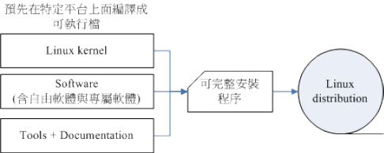
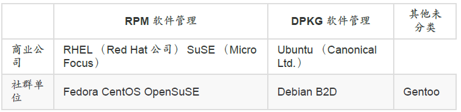

# 第一章 Linux是什么与如何学习

Created: Dec 15, 2020 11:11 AM
Tags: Dec 17, 2020 5:49 PM

## 1.1 Linux是什么

- Linux是操作系统
- Linux具有“可移植性”
- Linux稳定，提供了一个完整的操作系统中最底层的硬件控制和资源管理的完整架构（yan）

## 1.1.2 Linux之前，Unix的历史

### 1.1.3 GNU计划、自由软件与开发源代码

open source:

- 公布源代码且用户具有修改权
- 任意的再散布
- 必须允许修改或衍生的作品，且可让再发布的软件使用相似的授权来发表即可
- 承上，用户可使用和原生软件不同的名称或编号来散布
- 不可限制某些个人或团体的使用权
- 不可限制某些领域的应用
- 不可限制在某些产品当中
- 不可具有排他条款

专属软件/专利软件（close source）

## 1.2 Torvalds的Linux发展

- Linux是有芬兰人Torvalds(托瓦兹)发明的

POSIX：可携式操作系统接口（Portable Operating System Interface），规范核心与应用程序之间的接口

Linux的核心版本编号

3.10.0-123.el7.x86_64
主版本.次版本.释出版本-修改版本

主、次版本为奇数：发展中版本（development）
主、次版本为偶数：稳定版本（stable）

Linux distributions Linux发布商套件

两大系统

- 使用RPM方式安装软件的系统
- 使用dpkg方式安装软件的系统

## 1.3 Linux当前应用的角色

### 1.3.1 企业环境的利用

- 网络服务器s
- 关键任务的应用（金融数据库、大型企业网管环境）
- 学术机构的高性能运算任务

### 1.3.2 个人环境的使用

- 桌面电脑
- 手持系统（PDA、手机）
- 嵌入式系统

### 1.3.3 云端运用

- 云程序
- 端设备

## 1.4 Linux该如何学习