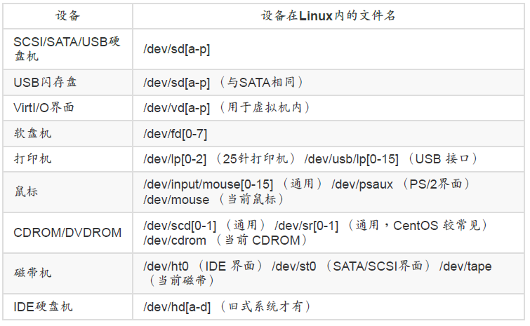
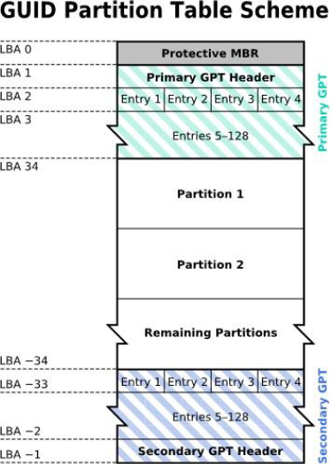
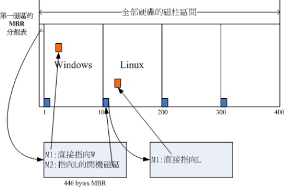
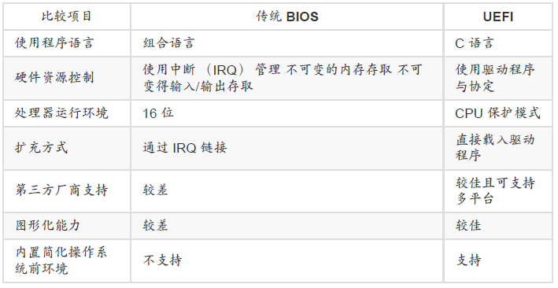

# 第二章 主机规划与磁盘分区

Created: Dec 15, 2020 11:11 AM
Tags: Dec 17, 2020 6:58 PM

## 2.1 Linux与硬件的搭配

各硬件设备在Linux中的文件名

## 2.2 磁盘分区

### 磁盘连接的方式与设备文件名关系

实体机器使用/dev/da[a-]的磁盘文件名

虚拟机环境使用/dev/vd[a-p]的磁盘文件名

### MSDOS(MBR)与GPT磁盘分区表(partition table)

MSDOS （MBR） 分区表格式与限制
MBR(Master Boot Record, 主要开机纪录区)，开机管理程序纪录区与分区表则通通放在磁盘的第一个扇区， 这个扇区通常是 512Bytes 的大小，所以第一个扇区 512Bytes 会有这两个数据：

- 主要开机记录区（Master Boot Record, MBR）：可以安装开机管理程序的地方，有446Bytes
- 分区表（partition table）：记录整颗硬盘分区的状态，有64 Bytes

注意：由于分区表所在区块仅有64 Bytes容量，因此最多**仅能有四组记录区**，每组记录区记录了该区段的启始与结束的柱面号码。这四个分区的记录被称为主要（Primary）或延伸（Extended）分区。

分区命名：假设硬盘设备文件名为/dev/sda时，四个分区在Linux系统中的设备文件名后面会再接一个数字

分区的原因：

1. 数据的安全性
2. 系统的性能考虑

> 延伸分区的目的是使用额外的扇区来记录分区信息，延伸分区本身并不能被拿来格式化。

由延伸分区持续切割出来的分区，就被称为逻辑分区（logical partition）。

逻辑分区的设备名称号码从5开始，前面四个号码都是保留给Primary或Extended用的(即使没有用到)

MBR分区限制：

- 操作系统无法抓取到 2.2T 以上的磁盘容量！
- MBR 仅有一个区块，若被破坏后，经常无法或很难救援。
- MBR 内的存放开机管理程序的区块仅 446Bytes，无法容纳较多的程序码。

### GUID partition table, GPT 磁盘分区表

为了相容于所有磁盘，，因此在扇区的定义上面， 大多会使用所谓的逻辑区块位址（Logical Block Address, LBA）来处理。GPT 将磁盘所有区块以此 LBA（默认为 512Bytes 喔！） 来规划，而第一个 LBA 称为 LBA0 （从 0 开始编号）。

与 MBR 仅使用第一个 512Bytes 区块来纪录不同， GPT 使用了 34 个 LBA 区块来纪录分区信息

- LBA0 （MBR 相容区块）
- LBA1 （GPT 表头纪录）
- LBA2-33 （实际纪录分区信息处）

### 开机流程中的 BIOS 与 UEFI 开机检测程序

主机系统在载入硬件驱动方面的程序，主要有早期的 BIOS 与新的 UEFI 两种机制

- BIOS 搭配 MBR/GPT 的开机流程

    1. BIOS：开机主动执行的固件，会认识第一个可开机的设备；
    2. MBR：第一个可开机设备的第一个扇区内的主要开机记录区块，内含开机管理程序；
    3. 开机管理程序（boot loader）：一支可读取核心文件来执行的软件；
    4. 核心文件：开始操作系统的功能...

    如果分区是GPT格式的话，BIOS 也能够从 LBA0 的 MBR 相容区块读取第一阶段的开机管理程序码，但需要开机管理程序能识别GPT

    > 由于 LBA0 仅提供第一阶段的开机管理程序码，因此如果你使用类似 grub 的开机管理程
    > 序的话，那么就得要额外分区出一个“ BIOS boot ”的分区， 这个分区才能够放置其他开机过
    > 程所需的程序码！在 CentOS 当中，这个分区通常占用 2MB 左右而已。

    开机管理程序(boot loader)主要任务：

    - 提供菜单：不同的开机项目
    - 载入核心文件：直接指向可开机的程序区段来开始操作系统
    - 转交其他loader：将开机管理功能转交给其他loader负责

    上述的第三点，涉及到多重开机

    

    MBR的开机程序提供两个菜单，菜单一(M1)可以载入Windows的核心文件来开机，菜单二(M2)则是将开机管理工作交给第二个分区的开机扇区(boot sector)。

    第二个开机管理程序，载入Linux的核心文件开机
    总计：

    - 每个分区都拥有自己的开机扇区（boot sector）
    - 图中的系统盘为第一及第二分区，
    - 实际可开机的核心文件是放置到各分区内的！
    - loader只会认识自己的系统盘内的可开机核心文件，以及其他loader而已；
    - loader可直接指向或者是间接将管理权转交给另一个管理程序

    > 多系统，最好先安装Windows再安装Linux

- UEFI BIOS 搭配 GPT 开机的流程

### Linux安装模式下，磁盘分区的选择

- 目录树结构（directory tree）
    以根目录为主，然后向下呈现分支状的目录结构的一种文件架构

- 文件系统与目录树的关系（挂载）

    利用一个目录当成进入点， 将磁盘分区的数据放置在该目录下 

## 2.3 安装Linux前的规划

### 选择适当的发行版

- 最新的发行版最佳

